# COMO FUNCIONA VitalLogix (Sin tecnicismos pesados)

Este documento es para personas junior, estudiantes o cualquier persona curiosa.
La idea no es memorizar código: la idea es entender el flujo de la información.

## 1) La gran imagen

Imagina una mensajería:

- Frontend (React): es la ventanilla donde alguien entrega un paquete.
- Backend (Spring Boot): es el centro logístico que revisa reglas y decide qué hacer.
- Base de datos (PostgreSQL): es el archivo central donde queda guardado el historial.

En VitalLogix pasa algo parecido:

- En la pantalla haces una acción (por ejemplo, vender un medicamento).
- El servidor valida si la acción es correcta.
- Si todo está bien, guarda cambios en la base de datos.
- Luego responde al frontend para que te muestre el resultado.

## 2) El camino de una venta (Flujo principal)

Cuando una persona hace clic en "Vender", ocurre esto:

1. Petición (Request)
- El frontend envía un JSON al backend con información como producto, cantidad y cliente.

2. Validación de negocio
- Spring Boot revisa reglas importantes:
- Existe el producto.
- Hay stock suficiente.
- Los datos obligatorios de la venta están completos.

3. Persistencia
- Si todo es válido, el backend le pide a PostgreSQL:
- Descontar stock del medicamento.
- Crear el registro de la venta.
- Guardar datos de cliente e historial.

4. Respuesta (Response)
- El backend responde con éxito o error.
- El frontend muestra confirmación y, si aplica, el ticket/recibo final.

Ejemplo real de lógica de negocio (clienteamigo):

- Si la venta se asocia a un cliente con programa clienteamigo activo, el backend aplica 10% de descuento antes de guardar el total final.
- Ese descuento queda registrado y luego se refleja en el ticket/recibo.

## 3) El lenguaje de las entidades (Los actores)

Piensa en estas tablas/modelos como actores del sistema:

- Medicamento: el protagonista. Tiene nombre, precio, stock, categoría y fecha de vencimiento.
- Venta: el evento principal. Registra qué se vendió, cuándo y por cuánto.
- Cliente: persona asociada a ventas e historial. Incluye su número de clienteamigo.
- Categoría: organiza los productos para buscar, filtrar y administrar mejor.

Relaciones simples:

- Una venta puede incluir uno o varios medicamentos.
- Un cliente puede tener muchas ventas a lo largo del tiempo.
- Un medicamento pertenece a una categoría.

## 4) Tecnologías y por qué se usan

No es solo "qué usamos", sino "para qué sirve":

- Java + Spring Boot
- Es el cerebro del sistema.
- Aplica reglas de negocio y expone endpoints seguros para el frontend.

- PostgreSQL
- Es la memoria confiable del proyecto.
- Guarda datos relacionales (clientes, ventas, productos, categorías) con consistencia.

- React
- Es la cara del sistema.
- Permite una experiencia fluida para buscar productos, vender y administrar.

## 5) Un ejemplo rápido de extremo a extremo

Caso: vender 1 unidad de un medicamento.

1. En la UI eliges producto y cantidad.
2. React envía la solicitud al backend.
3. El backend valida stock y reglas.
4. PostgreSQL guarda la venta y actualiza inventario.
5. El backend responde "ok".
6. La UI muestra confirmación y datos de la venta.

Ese ciclo se repite para casi todo: crear clientes, aprobar categorías, generar reportes, etc.

## 6) Glosario para principiantes

- API
- La puerta de comunicación entre frontend y backend. El frontend "pregunta" y la API "responde".

- Endpoint
- Una dirección específica dentro de la API para hacer una acción concreta.

- JSON
- Formato de texto para enviar datos entre sistemas.

- Query
- Consulta a la base de datos para leer o modificar información.

- Estado (State) en frontend
- Información temporal que React usa para pintar la pantalla (listas, formularios, modales, etc.).

- Validación
- Reglas que impiden guardar datos inválidos (por ejemplo, vender sin stock).

- Persistencia
- Guardar información de forma permanente en la base de datos.

## 7) Cómo leer el proyecto sin perderte

Ruta recomendada para alguien junior:

1. Mira primero la pantalla (frontend) para entender qué acciones existen.
2. Identifica qué llamada API hace esa acción.
3. Revisa el controlador/servicio del backend que recibe esa llamada.
4. Sigue hasta el repositorio/modelo para ver qué se guarda en PostgreSQL.

Rutas reales para ubicarte rápido:

1. Frontend (pantallas y componentes):
- [frontend/src/components](frontend/src/components)
- [frontend/src/App.jsx](frontend/src/App.jsx)
- [frontend/src/services/api.js](frontend/src/services/api.js)

2. Backend (entrada HTTP y reglas):
- [backend/src/main/java/com/vitallogix/backend/controller](backend/src/main/java/com/vitallogix/backend/controller)
- [backend/src/main/java/com/vitallogix/backend/service](backend/src/main/java/com/vitallogix/backend/service)
- [backend/src/main/java/com/vitallogix/backend/repository](backend/src/main/java/com/vitallogix/backend/repository)
- [backend/src/main/resources/application.properties](backend/src/main/resources/application.properties)

Si sigues ese camino, el proyecto deja de verse grande y empieza a verse lógico.

## 8) Experiencia de un desarrollador del equipo

¡Hola! Soy Luis Dzib, uno de los desarrolladores que conforman el equipo detrás de VitalLogix.

Este proyecto nació como una asignación escolar, pero rápidamente se convirtió en un desafío grupal. Al ser mi primer proyecto integral como parte de un equipo de desarrollo, me enfrenté a muchísimos errores compartidos. Sin embargo, aprender de ellos en conjunto y refinar cada detalle como equipo es lo que nos ha permitido llegar a la versión que ves hoy.

### El inicio y el "salto" de fe

Como puedes ver en las imágenes de la primera versión, comencé utilizando NetBeans, pero decidí ir más allá de lo que se enseña en el aula. Mis profesores siempre recalcan que lo aprendido en clase no es suficiente y que debemos investigar por nuestra cuenta. Inspirado por alumnos de semestres avanzados, decidí emprender este proyecto extracurricular.

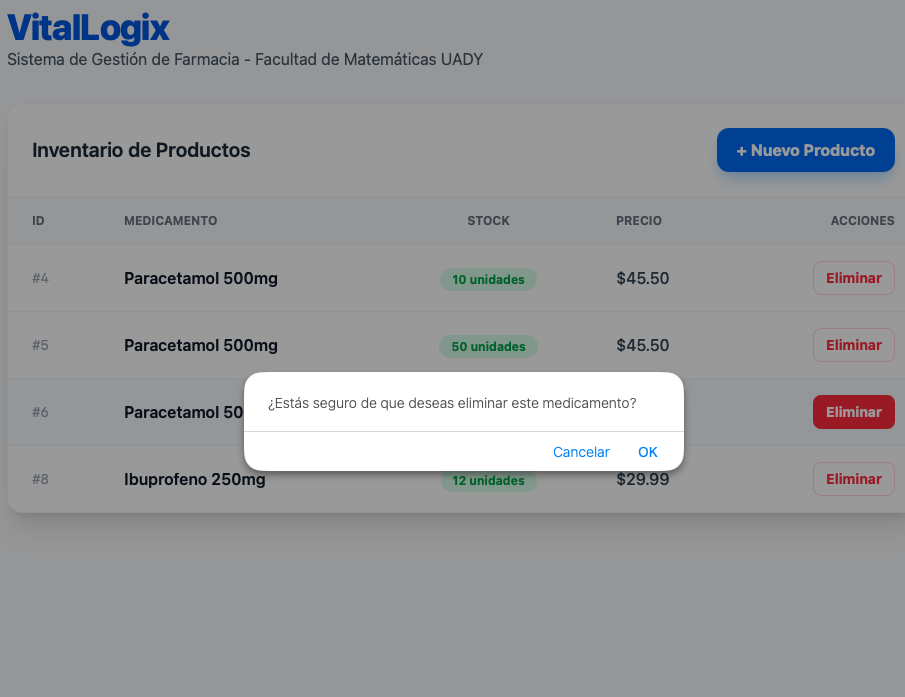

Es verdad lo que dicen: "La práctica hace al maestro". Al migrar mi código de NetBeans a Visual Studio Code y comenzar a explorar Docker, me topé con muros constantes: errores de conexión entre el frontend y el backend, problemas con el inicio de sesión y la gestión de roles.

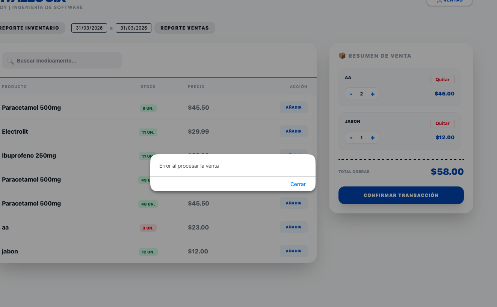
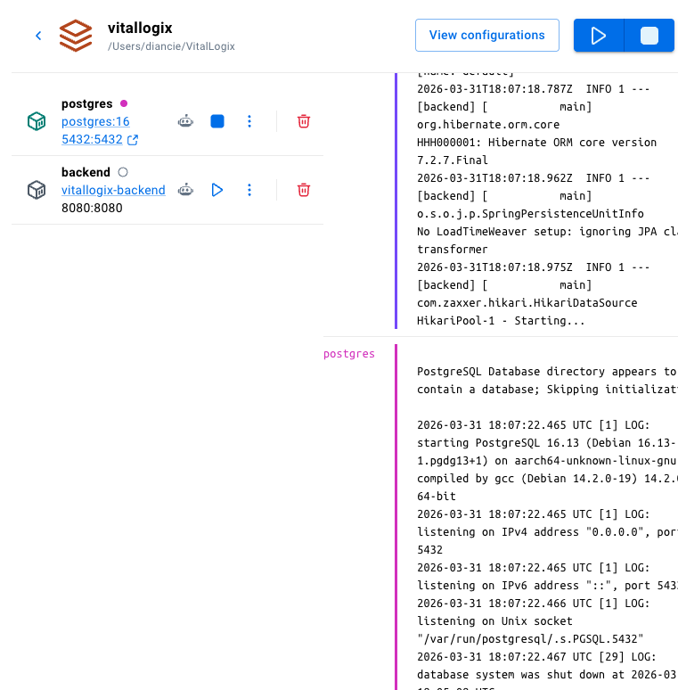
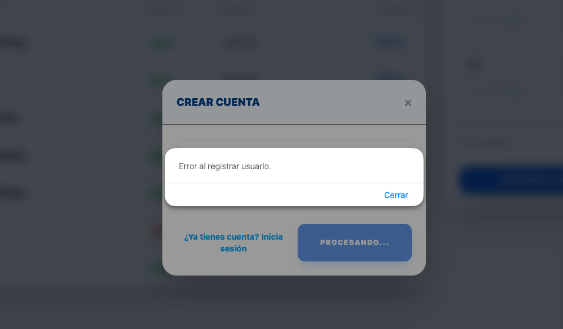

Hubo un momento en el que quise rendirme y esperar a que me lo enseñaran en la escuela, pero sabía que no podría aportar lo necesario a mi equipo. El aprendizaje compartido y la responsabilidad con mis compañeros me motivó a seguir investigando y superando cada obstáculo.

### La IA como mi "maestro" 24/7

Aprender por cuenta propia puede ser difícil para nosotros los "mortales". Fue ahí donde decidí recurrir a la Inteligencia Artificial, no como un sustituto de mi pensamiento, sino como un profesor particular.

Algunos creen que usar IA es "hacer trampa", pero yo lo veo como cambiar un hacha por una motosierra: sigue siendo tu trabajo, pero con una herramienta que potencia tu avance. Gracias a ese apoyo logré entender mejor la terminal, descubrir funciones útiles de VS Code y comprender conceptos de arquitectura que antes veía muy lejanos.

En esta etapa aprendí algo clave: usar IA como apoyo no reemplaza el aprendizaje; lo acelera cuando uno valida, prueba y entiende cada cambio.

### Implementando desafíos: algoritmo de la mochila (0/1)

Inspirado por la interfaz de Amazon y por lo aprendido en conferencias, decidí implementar el algoritmo de la mochila para el sistema de sugerencias.

El reto fue claro: ¿cómo ofrecerle al usuario la mejor combinación de productos sin exceder su presupuesto?

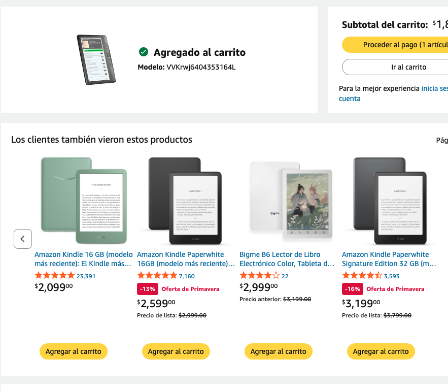
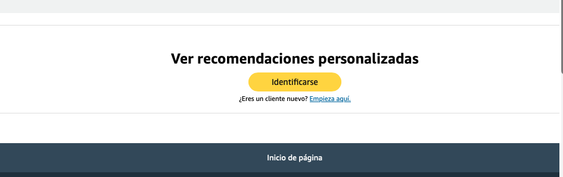
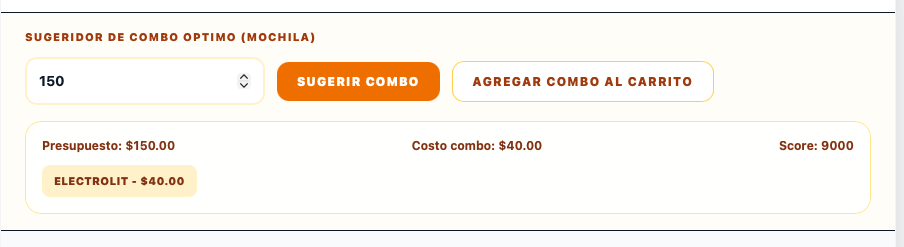

Aunque al principio el código no funcionó como esperaba, eso me obligó a estudiar la lógica, renombrar variables, validar resultados y entender cada parte hasta hacerlo funcionar por convicción propia.

### Evolución de interfaz y refinamientos

Después vinieron varias iteraciones para mejorar no solo el código, sino también la experiencia de usuario. Me inspiré en la fluidez de interfaces conocidas para pulir formularios, navegación y detalles visuales.

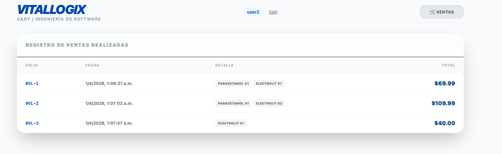
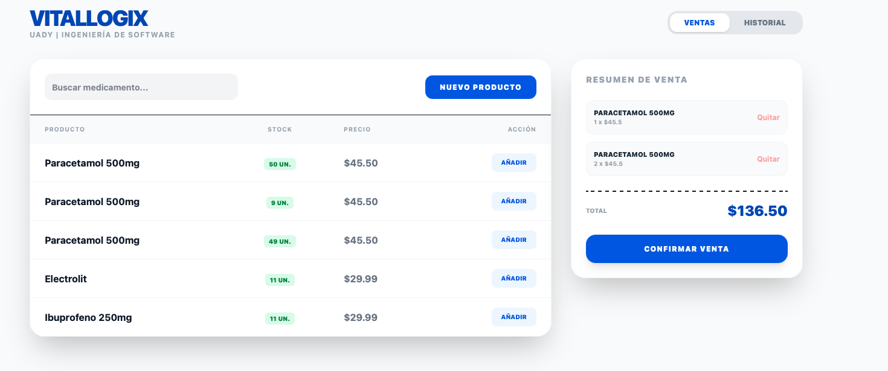
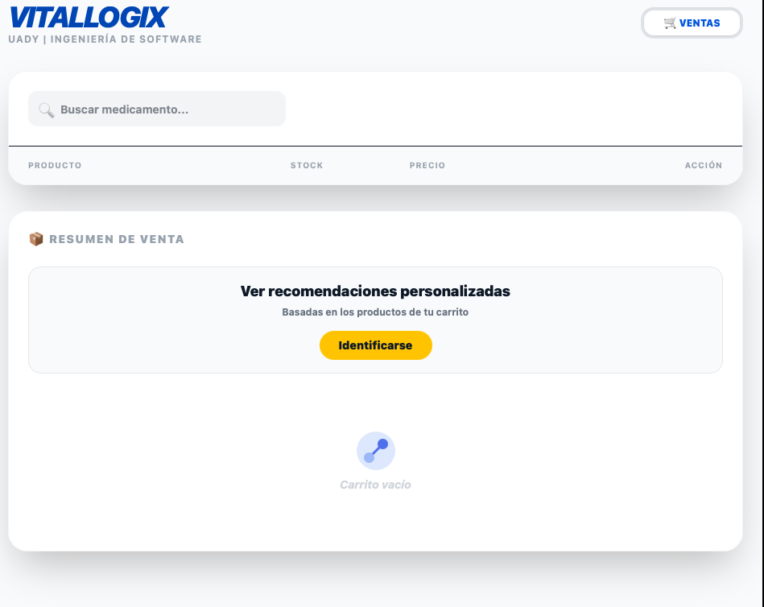
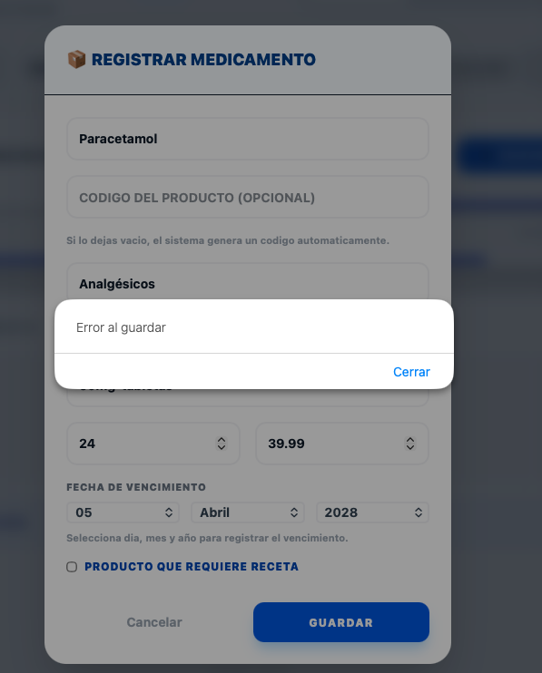
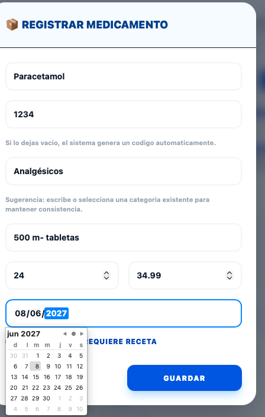

Con cada iteración mejoré estructura, estilos y mantenibilidad. También entendí por qué aplicar principios de diseño como SOLID no es solo teoría: realmente facilita extender, depurar y mantener el proyecto.

### Mi consejo para ti (y para tu equipo)

- Nadie nace sabiendo; la diferencia real es la práctica acumulada.
- No intentes aprender todo de golpe.
- Enfócate en una cosa a la vez.
- **Comparte tu aprendizaje con tu equipo**: la mejor forma de consolidar conocimiento es explicarlo a otros.
- Practica, equivócate (juntos), corrige y vuelve a intentar.

Mi próximo objetivo, junto con el equipo, es crear videos para ayudar a otros desarrolladores como nosotros: personas que necesitan ver el proceso paso a paso para perder el miedo a la tecnología y entender que el trabajo en equipo potencia el aprendizaje.

Este proyecto fue desarrollado en macOS (Unix), por lo que funciona muy bien en Linux. Si usas Windows, una buena opción es trabajar con Ubuntu/WSL para aprovechar mejor comandos de entorno Unix.

Gracias por leer nuestra historia y acompañarnos en esta primera gran experiencia de desarrollo colaborativo. ¡Hasta pronto!
