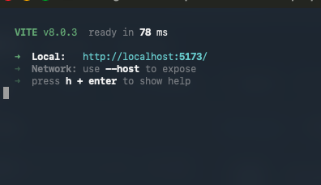

# VitalLogix

Sistema de gestión de farmacia construido por nuestro equipo con Java, PostgreSQL y React.

## Navegación

- [English](README.md)
- [Español](README.es.md)
- [Índice de documentación](docs/README.md)

## Enlaces Rápidos

- [Backend](backend/)
- [Frontend](frontend/)
- Módulo desktop: reservado para trabajo futuro, actualmente vacío.
- [Documentación](docs/)

## Descripción General

VitalLogix cubre inventario, ventas, clientes, reportes y gestión de categorías en un flujo web.

## ¿Quieres entender cómo funciona este proyecto?

Si eres estudiante, junior o simplemente tienes curiosidad sobre la arquitectura de **VitalLogix**,
preparamos una guía simplificada y sin tecnicismos innecesarios:

👉**[Lee la guía paso a paso: COMO-FUNCIONA.md](COMO-FUNCIONA.md)**

En este archivo explicamos de forma clara cómo se comunica PostgreSQL con el servidor en Java
y cómo esa información llega al frontend en React.

También lo utilizamos como bitácora visual para documentar la evolución del proyecto con capturas de interfaz,
y compartimos nuestra experiencia como equipo desarrollador en este viaje de aprendizaje y crecimiento.

## Mapa del Repositorio

- [backend/](backend/) API Spring Boot, modelo de dominio y servicios
- [frontend/](frontend/) Interfaz React para inventario, ventas y administración
- [desktop/](desktop/) Módulo desktop: reservado para trabajo futuro, actualmente vacío.
- [docs/](docs/) Centro de documentación del proyecto
- [backend/src/main/java/com/vitallogix/backend/controller/CategoryController.java](backend/src/main/java/com/vitallogix/backend/controller/CategoryController.java) endpoints de administración de categorías
- [frontend/src/components/CategoryManagementPanel.jsx](frontend/src/components/CategoryManagementPanel.jsx) panel de categorías para admin
- [frontend/src/App.jsx](frontend/src/App.jsx) shell principal y vistas por rol

## Estructura del Proyecto

- `backend/` API en Spring Boot y lógica de negocio
- `frontend/` Interfaz web en React
- `desktop/` Módulo desktop planeado (placeholder)
- `docs/en/` Documentación en inglés
- `docs/es/` Documentación en español

## Requerimientos Funcionales

### 1. Gestión de Inventarios

- Nuestro sistema debe permitir la incorporación de nuevos productos al inventario.
- Debemos permitir la actualización de existencias de productos.
- Debemos registrar la fecha de vencimiento de los productos.
- Debemos permitir la eliminación de productos obsoletos o vencidos.

### 2. Registro de Ventas

- Nuestro sistema debe permitir la venta de productos al cliente.
- Debemos calcular automáticamente el precio total de la compra.
- Debemos registrar la información del cliente (nombre, dirección, número de contacto) para ventas con receta.
- Debemos generar un recibo para cada venta.

### 3. Búsqueda y Consulta de Productos

- Debemos permitir la búsqueda rápida de productos por nombre, código o categoría.
- Debemos proporcionar información detallada de cada producto, incluyendo precio, existencias y fecha de vencimiento.

### 4. Gestión de Clientes

- Debemos permitir la creación y mantenimiento de registros de clientes.
- Debemos proporcionar información sobre las compras anteriores de los clientes.
- Debemos permitir la asignación de descuentos o programas de fidelización a clientes habituales.
- Nuestros clientes deben contar con un número de `clienteamigo` que les permita acceder a nuestro programa de descuentos.

### 5. Generación de Reportes

- Debemos ser capaces de generar informes de ventas diarias, semanales, mensuales y anuales.
- Debemos proporcionar informes de inventario actualizados.

### 6. Gestión de Categorías

- Nuestro sistema incluye un módulo de categorías con tipos predefinidos y personalizados.
- Permitimos que las categorías personalizadas se envíen para aprobación o rechazo.
- Hacemos que las categorías activas estén disponibles en formularios de producto y filtros de inventario.

## Requerimientos No Funcionales

### 1. Interfaz de Usuario Intuitiva

- Nuestra interfaz debe ser simple, clara y fácil de usar.
- Nuestro sistema debe permitir identificar rápidamente acciones de inventario, ventas, clientes y reportes.

## Evidencias SOLID (mínimo 3 principios)

Para un análisis completo de la arquitectura del backend incluyendo **5 principios SOLID**, **7 patrones de diseño** y evidencia específica de código, consulta:
- [Principios SOLID y Patrones de Diseño (Español)](docs/SOLID_Y_PATRONES_DISEÑO.md)

### SRP: Single Responsibility Principle

- `App.jsx` delega la gestión de clientes en un panel especializado para reducir responsabilidades del componente raíz.
- `CustomerManagementPanel.jsx` concentra carga de clientes e historial de compras en un solo módulo de UI.
- Evidencia: [frontend/src/App.jsx](frontend/src/App.jsx), [frontend/src/components/CustomerManagementPanel.jsx](frontend/src/components/CustomerManagementPanel.jsx)

### DIP: Dependency Inversion Principle

- `ReportController` depende de la abstracción `ReportServicePort` en lugar de depender de una implementación concreta.
- `ReportService` implementa esa interfaz y encapsula la lógica de reportes.
- Evidencia: [backend/src/main/java/com/vitallogix/backend/controller/ReportController.java](backend/src/main/java/com/vitallogix/backend/controller/ReportController.java), [backend/src/main/java/com/vitallogix/backend/service/ReportServicePort.java](backend/src/main/java/com/vitallogix/backend/service/ReportServicePort.java), [backend/src/main/java/com/vitallogix/backend/service/ReportService.java](backend/src/main/java/com/vitallogix/backend/service/ReportService.java)

### OCP: Open/Closed Principle

- El motor de sugerencias usa parámetros de configuración (`app.suggestion.*`) para extender comportamiento sin cambiar el flujo principal del algoritmo bandido.
- Evidencia: [backend/src/main/java/com/vitallogix/backend/service/ComboSuggestionService.java](backend/src/main/java/com/vitallogix/backend/service/ComboSuggestionService.java)

## Matriz de Acceso por Rol

- **Invitado**: puede consultar productos y categorías activas; no puede generar ventas ni administrar datos.
- **Usuario**: puede operar ventas; no puede administrar productos, reportes ni módulos administrativos.
- **Admin**: acceso completo a productos, reportes, clientes, historial y categorías (incluyendo aprobaciones).

## Clonar el repositorio

1. Abre una terminal y clona el proyecto completo, escribiendo:
   - `git clone https://github.com/diancie/VitalLogix.git`
2. Entra a la carpeta raíz del proyecto:
   - `cd VitalLogix`

## Primeros Pasos

Antes de ejecutar con Docker, crea tu archivo de entorno local:

1. Copia `.env.example` a `.env`
2. Reemplaza todos los valores `change_me_*` por tus propios secretos

Este paso permite personalizar tus credenciales de prueba.
En tu `.env` puedes definir a tu gusto:

- Usuario admin inicial: `APP_BOOTSTRAP_ADMIN_USERNAME`
- Contraseña admin inicial: `APP_BOOTSTRAP_ADMIN_PASSWORD`
- Usuario demo: `APP_BOOTSTRAP_DEMO_USER_USERNAME`
- Contraseña demo: `APP_BOOTSTRAP_DEMO_USER_PASSWORD`

Ejemplo rápido:

```env
APP_BOOTSTRAP_ADMIN_USERNAME=admin_laboratorio
APP_BOOTSTRAP_ADMIN_PASSWORD=MiPasswordAdminSegura123
APP_BOOTSTRAP_DEMO_USER_USERNAME=usuario_pruebas
APP_BOOTSTRAP_DEMO_USER_PASSWORD=MiPasswordUserSegura123
```

1. Desde la carpeta raíz del proyecto (`VitalLogix`), levanta la base de datos y el backend:
	- `docker compose up -d --build vitallogix-app`
2. Abre una segunda terminal y vuelve a la carpeta del proyecto:
	- `cd VitalLogix`
3. Levanta el frontend:
	- `npm --prefix frontend run dev`
4. Abre la aplicación en tu navegador:

   Cuando el comando termine, verás un mensaje parecido al de esta imagen:

   

   Luego abre el enlace que aparece en la terminal:

   - En macOS: mantén presionada la tecla Command (⌘) y haz clic sobre el enlace.
   - En Windows/Linux: mantén presionada la tecla Ctrl y haz clic sobre el enlace.
   - Manualmente: copia la dirección que aparece después de `Local:` y pégala en la barra de direcciones de tu navegador.

   > **Nota:** Vite usa normalmente el puerto `5173`. Si está ocupado, te asignará otro automáticamente, como `5174`.
   > Usa siempre el puerto que te indique la terminal.

## Ejecutar Sin Docker

Si prefieres no usar Docker, también puedes ejecutar el proyecto completamente en local.

Requisitos previos:
- Java 21
- Maven (o usar el Maven Wrapper incluido en este repo)
- PostgreSQL 16
- Node.js 18+ y npm

1. Crea la base de datos y credenciales en PostgreSQL:
   - Base de datos: `vitallogix`
   - Usuario: `vitallogix`
   - Contraseña: `vitallogix123`
2. Levanta el backend desde la raíz del repositorio:
   - macOS/Linux: `./backend/mvnw -f backend/pom.xml spring-boot:run`
   - Windows: `backend\\mvnw.cmd -f backend\\pom.xml spring-boot:run`
3. Levanta el frontend en una segunda terminal desde la raíz del repositorio:
   - `npm --prefix frontend install`
   - `npm --prefix frontend run dev`

Si tus credenciales locales de PostgreSQL son diferentes, configura variables de entorno en lugar de editar archivos versionados.

## Primer Acceso Admin (para repos clonado)

En el primer arranque del backend, la aplicación crea un admin bootstrap usando variables de entorno.

- Usuario: `APP_BOOTSTRAP_ADMIN_USERNAME` (por defecto: `admin1`)
- Contraseña: `APP_BOOTSTRAP_ADMIN_PASSWORD` (definida en tu `.env`)

Además, si dejas `APP_BOOTSTRAP_DEMO_USER_ENABLED=true`, también se crea un usuario demo para pruebas funcionales.

Después de iniciar sesión como admin, puedes crear más usuarios/admins desde el panel de administración según tus necesidades de prueba.

Así cualquier persona que clone el repositorio puede probar funciones de admin sin compartir credenciales reales de producción.

## Puntos de Entrada Importantes

- [SecurityConfig.java](backend/src/main/java/com/vitallogix/backend/config/SecurityConfig.java)
- [CategoryService.java](backend/src/main/java/com/vitallogix/backend/service/CategoryService.java)
- [CategoryManagementPanel.jsx](frontend/src/components/CategoryManagementPanel.jsx)
- [api.js](frontend/src/services/api.js)

## Documentación

Guía local para compartir este proyecto con una configuración gratuita y local:

- [Guía local para compartir demo gratis (Español)](docs/LOCAL_DEMO_SHARE_GUIDE_ES.txt)
- [Índice de documentación](docs/README.md)

### Diagramas en Astah

- [Diagrama de casos de uso VitalLogix](docs/diagrams/UseCase%20VitalLogix.asta)
- [Diagrama de clases VitalLogix](docs/diagrams/ClassDiagram%20VitalLogix.asta)
- [Diagrama completo modelo VitalLogix](docs/diagrams/VitalLogixModelComplete.asta)

### Notas del sistema

- [Notas del sistema de categorías](docs/CATEGORY_MANAGEMENT_SYSTEM.md)
- [Notas del panel de administración de categorías](docs/ADMIN_CATEGORY_PANEL.md)
